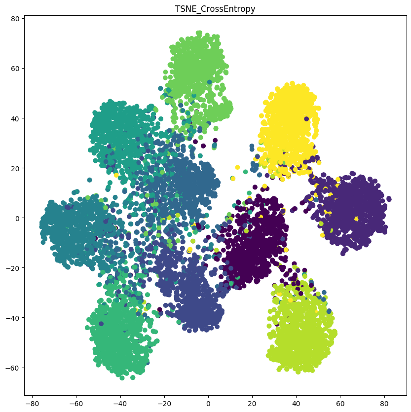
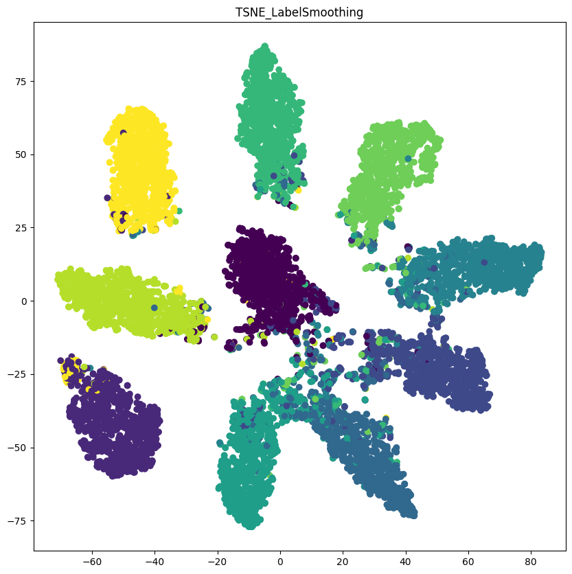

# When Does Label Smoothing Help??? pytorch implementation

paper : https://arxiv.org/abs/1906.02629

<hr>

Cross Entropy   : **python main.py --ce** -> **python TSNE.py --ce**

Label Smoothing : **python main.py** -> **python TSNE.py**

<hr>

simple Label Smoothing implementation code. 

```python

class LabelSmoothingCrossEntropy(nn.Module):
    def __init__(self):
        super(LabelSmoothingCrossEntropy, self).__init__()
    def forward(self, x, target, smoothing=0.1):
        confidence = 1. - smoothing
        logprobs = F.log_softmax(x, dim=-1)
        nll_loss = -logprobs.gather(dim=-1, index=target.unsqueeze(1))
        nll_loss = nll_loss.squeeze(1)
        smooth_loss = -logprobs.mean(dim=-1)
        loss = confidence * nll_loss + smoothing * smooth_loss
        return loss.mean()
```
```python
from utils import LabelSmoothingCrossEntropy

criterion = LabelSmoothingCrossEntropy()
loss = criterion(outputs, targets)
loss.backward()
optimizer.step()
```
<hr>


Visualized using TSNE algorithm with CIFAR10 Dataset.  "When Does Label Smoothing Help ???" As mentioned, you can use label smoothing to classify classes more clearly.

<div>


</div>

